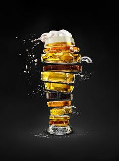

# project-3
Machine Learning Fun with Beer

## Beer Reviews

https://www.kaggle.com/stpeteishii/beer-information-visualize-importance

## Beer characteristics

https://www.kaggle.com/rdoume/beerreviews

### Contents:

Can Machines Taste Differences in Beer Styles? (Neural Network)

The stronger the beer, the higher the rating? (Random Forest) 

Good vs. 'meh..' beers (Random Forest, KNN, Logistic Regression, SVM)

Cross-review Regression Analysis (MSE, Lasso, Ridge, Elasticnet)
